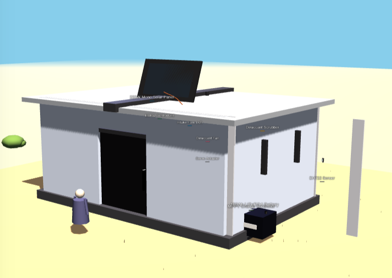

# OASIS Pod
**Off-Grid Autonomous Shelter for Indian Summers**

### 🏆 Asian Hackathon for Green Future 2026
*A sustainable, AI-driven solution for extreme climate resilience.*
[Learn more about the hackathon](https://panafricanvisions.com/2026/04/launch-of-the-asian-hackathon-for-green-future-2026-with-a-total-prize-pool-of-usd-24000/)

---

## 🌍 The Vision
OASIS is a modular, off-grid emergency shelter system designed to replace power-hungry refrigeration cycles with smart thermal physics and Edge AI. It maintains safe internal temperatures (28°C) even when ambient heat exceeds 45°C. The system is fully scalable, allowing for customized dimensions and occupancy capacities based on specific regional needs and thermal load calculations.

## 🛠️ Key Technologies
- **PCM Thermal Battery**: Passively locks internal temperatures by absorbing latent heat through wall-integrated Phase Change Materials.
- **Edge AI (ESP32)**: Runs a TensorFlow Lite model to predict thermal loads and autonomously manage "Night-Flush" and humidity cycles.
- **Radiative MgO-PVDF Skin**: A high-tech coating that rejects 95% of solar flux while emitting heat back into deep space.
- **Solar Microgrid**: Ultra-low consumption (<800Wh/day), fully operational on a single 220W panel.

## ☘️ Social & Environmental Impact
- **Zero Emissions**: Uses no traditional refrigerants (GWP-free) and operates entirely on renewable energy.
- **Scalability**: Designed for rapid deployment in urban slums, rural areas, and disaster relief zones.
- **Climate Justice**: Provides high-tech cooling to those who cannot afford traditional air conditioning or stable grid power.

## 🖥️ Digital Twin Prototype
The following interactive prototype validates spatial feasibility and real-time actuation logic.

---

### 🔗 Project Links
[**🚀 View Live Demo**](https://Vickyrrrrrr.github.io/Oasis/) | [**📄 Full Project Proposal**](./proposal.md)

---
*Created for the Asian Hackathon for Green Future 2026*
