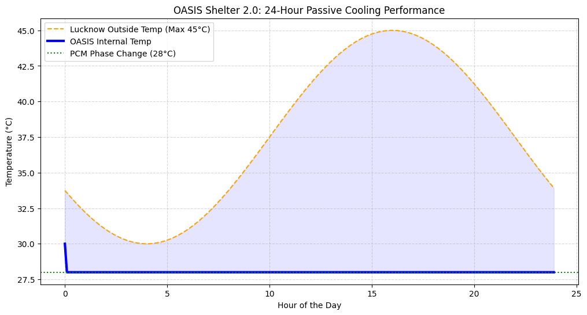
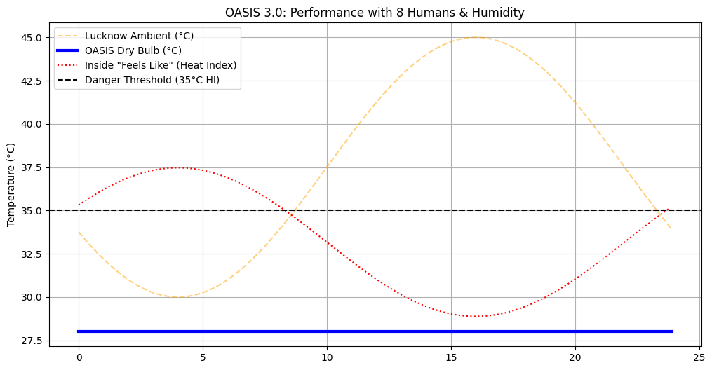
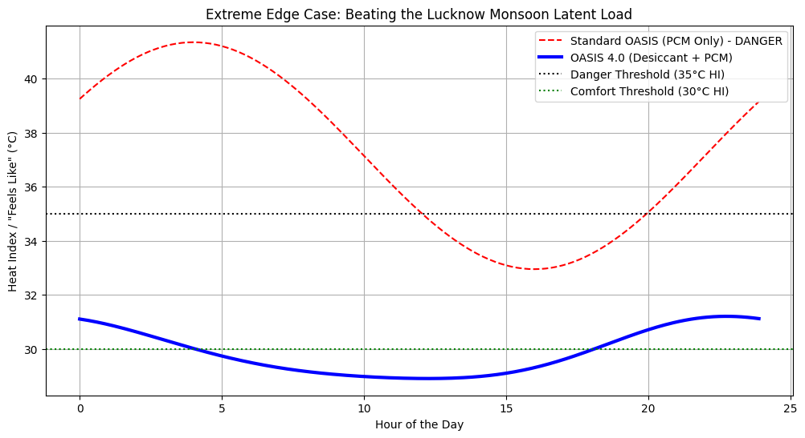
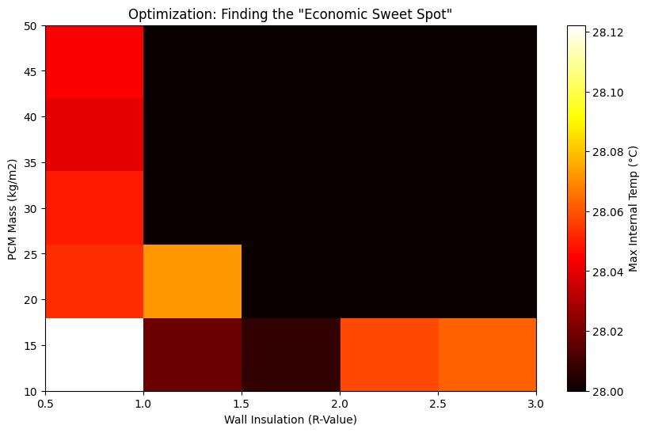

# PROJECT PROPOSAL: The OASIS Pod
**Modular Climate-Responsive Infrastructure Prototype**

## 1. Executive Summary
In regions experiencing severe climate shifts, extreme summer temperatures (often exceeding 45°C) combined with heavy monsoon humidity create deadly "Heat Index" conditions. Traditional Air Conditioning is unviable for many applications because it demands massive amounts of continuous power and relies on a stable electrical grid—which frequently fails during peak heat waves.

**OASIS** is a modular passive cooling infrastructure prototype designed to reduce HVAC dependency through climate-responsive passive-first design. Instead of treating cooling as an appliance problem, OASIS approaches it as a housing and infrastructure design challenge. Operating entirely on a highly efficient 12V solar microgrid, the OASIS Pod integrates a passive Phase Change Material (PCM) thermal battery, desiccant-assisted airflow, and an autonomous TinyML + ESP32 control unit to provide climate-resilient thermal safety.

**Primary Goal:** Provide climate-resilient thermal safety in environments where conventional cooling infrastructure is inaccessible, unreliable, or energy-intensive.

**Target Deployment Environments:**
- Heatwave-prone urban regions
- Disaster relief camps
- Rural low-electricity areas
- Temporary shelters
- Construction worker housing
- Climate-vulnerable communities

**Scalability Vision:** Prototype → emergency shelter → modular room-scale system → future climate-responsive housing infrastructure.

---

## 2. The Core Technology
The OASIS system is built on a 3-part hybrid architecture:

### A. The Passive Thermal Battery (Structural Walls)
Instead of fighting the heat with active compressors, the shelter uses the environment to its advantage. The shelter's walls are integrated with specific salt hydrate Phase Change Materials (PCM)—such as Glauber’s Salt or CrodaTherm 29—aligned to a ~28°C melting point. During the brutal 45°C day, the PCM silently melts, absorbing massive amounts of thermal energy (latent heat) without raising the ambient temperature. 

**Cost Optimization Strategy:** To ensure economic viability, PCM placement is selectively optimized. PCM is heavily integrated only into high solar-load surfaces (the roof and west-facing walls). This intelligent material distribution results in a nearly **50% reduction in PCM requirement** compared to fully enveloping the structure, significantly reducing overall costs while maintaining thermal safety.

### B. The Edge AI Brain (Predictive Logic)
The shelter's "nervous system" is powered by a low-cost ($5) ESP32 microcontroller running a custom Machine Learning model (TensorFlow Lite / TinyML). By continuously monitoring internal and external DHT22 environmental sensors, this supportive AI optimizes fan and vent actuation. It intelligently predicts incoming thermal loads and dangerous humidity spikes, allowing the shelter to react autonomously without human intervention or cloud-dependency.

### C. Active Environmental Control (Actuation)
To "recharge" the thermal battery and manage humidity, the AI controls two specific mechanical subsystems:
*   **The Night-Flush Cycle (Sensible Cooling):** When the AI detects that the outside night air has dropped below the internal temperature, it swings the servo-controlled vents open to 90° and engages heavy-duty 60W intake fans. This blasts cool night air into the wall cavities to "re-freeze" the PCM, fully recharging the thermal battery for the next day.
*   **The Desiccant Loop (Latent Cooling):** A critical engineering discovery during development was the extreme heat-index risk posed by monsoon conditions. A 30°C room can feel like a deadly 35°C due to high humidity. To resolve this, when the AI detects a humidity threshold breach (RH > 55%), it engages a desiccant-assisted circulation fan loop to actively scrub moisture from the air, maintaining a safe and comfortable Heat Index.

---

## 3. Simulation & Validation
All thermal dynamics, AI logic, and power economics were rigorously modeled and validated using Python in a Colab simulation environment before moving to physical hardware.

### A. Passive Cooling & Thermal Mass Modeling
We simulated diurnal temperature swings (Lucknow peak 45°C, low 30°C) for a 24-hour cycle. The simulation proves the PCM successfully absorbs the 12-hour thermal load, locking internal temperature at a safe 28°C despite 45°C ambient heat.

### B. The Humidity Crisis: A Critical Engineering Discovery
When we simulated the shelter under real occupancy conditions (8 humans inside, each radiating ~100W of metabolic heat), the dry-bulb temperature remained at 28°C. However, the "Feels Like" Heat Index spiked above the 35°C danger threshold. This revealed that sensible cooling alone is insufficient during Indian monsoons; humidity-aware thermal management is absolutely vital.

### C. The Desiccant-PCM Stack: Resolving the Monsoon Latent Load
To solve the humidity crisis, we modeled a 2-stage system: (1) a desiccant scrubber removing moisture from the incoming air, and (2) the PCM thermal battery cooling the dehumidified air. The PCM successfully re-cools the air, and the final Heat Index stays below the 35°C danger threshold. 

### D. Economic Sweet Spot Optimization
A multi-variable parametric sweep mapped PCM Mass against Wall Insulation R-Value. This revealed the "economic sweet spot," proving the shelter can be built affordably, especially when combined with our selective PCM placement strategy (roof and west walls only).

### E. Power System Sizing & Cost Analysis
The active system (ESP32, intake fans, desiccant fan, and servo) consumes only **756.50 Watt-hours per day**, allowing it to be powered by a single **218.54W solar panel**.

**Estimated Bill of Materials (Baseline Unit):**
| Component | Cost (USD) | Cost (INR) |
|-----------|-----------|-----------|
| Solar System & Battery | ~$325 | ₹26,968 |
| Control System (ESP32, Relays) | ~$24 | ₹2,000 |
| Optimized PCM (Salt Hydrates, Selective) | ~$600–$1,500 | ₹50,000–₹1,25,000 |
| **Total (Estimated Range)** | **~$949–$1,849** | **₹78,968–₹1,53,968** |

### F. Machine Learning & Digital Twin Validation
The predictive AI (TinyML) was exported to a TensorFlow Lite C++ array for the ESP32. This control system was translated into an interactive 3D WebGL Digital Twin to validate spatial feasibility and real-time actuation logic.

---

## 4. Sustainability & Scalability
Because OASIS reduces HVAC dependency rather than relying on traditional compressors, the energy footprint is reduced by over 90%. It targets urban heat resilience, passive climate adaptation, and reducing overall cooling energy demand.

The system is highly scalable. The materials are globally available and require virtually zero maintenance compared to refrigerant-based air conditioners.

---

## 5. Conclusion and Impact
**OASIS is not merely a cooling shelter. It is a prototype for how future housing systems may adapt sustainably to a warming planet.** By merging ancient passive cooling techniques with modern materials science and Edge AI, we have created a life-saving infrastructure that provides immediate relief today while laying the groundwork for the climate-responsive housing of tomorrow.
